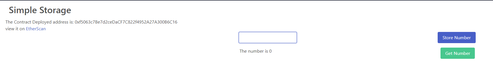

# Simple Storage Smart contract + Fron-end

This project uses the Simple Contract project base on [Patrick Collins](https://github.com/PatrickAlphaC) Simple Storage [code](https://github.com/PatrickAlphaC/brownie_simple_storage) and adds and extra layer for front-end using:

- NextJs
- Ethers.JS
- Deployement wiht Brownie

## Usage

>  Be sure to have enough Ether on Rinkeby TestNet.
Clone the source code and then simple type the following in your terminal:

`cd front-end`

Install the dependencies with

`yarn install`

Run the project with

`yarn dev`

Open your local host on port 3000

`http://localhost:3000/`

Enjoy!

## Note

Special thanks to Patrick and his Solidity and Blockchain course, this couldn't be possible without it.

